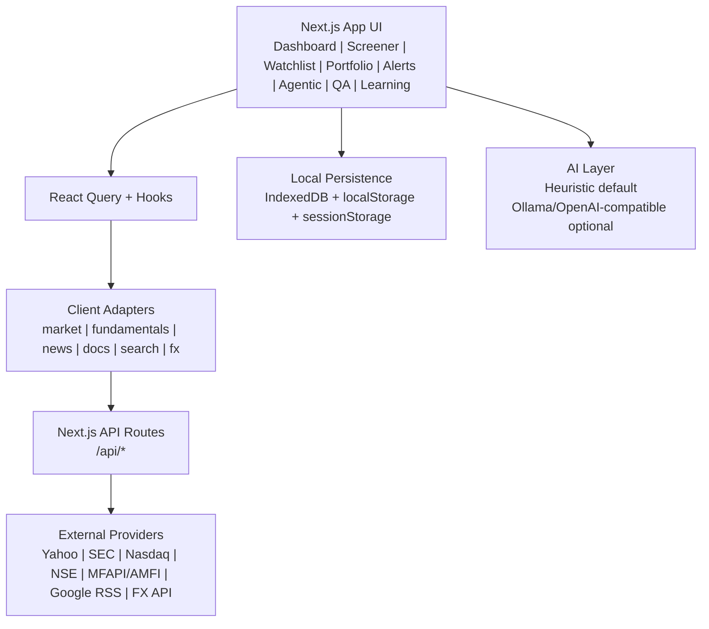

# Stock Metrics

The stock market is rich in information but fragmented in delivery. Investors frequently move between market quote pages, financial statement websites, screeners, portfolio trackers, news portals, learning resources, and notes applications to build a single view of a company or investment idea. 

This fragmentation increases the effort required for even basic analysis and creates a particularly difficult learning curve for beginners. Most existing financial platforms function primarily display data in their systems. They present raw financial statements, historical price charts, and a list of technical or fundamental ratios. While this information is comprehensive, it assumes that users already possess the expertise required to interpret it.

Beginners often feel overwhelmed by unfamiliar terminology such as EBITDA, P/E ratio, ROE or ROCE. On the other hand, experienced users frequently need deeper analytical tools that go beyond static ratios.

“AI-Powered Personalized Stock Metrics & Investment Dashboard” was designed as a response to these issues. It is a research-oriented finance web application that unifies stock discovery, multi-market analysis, charting, documents, news, notes, screening, learning resources, alerts, local portfolio tracking, and AI-based interpretation under one system. 

It has a defining innovation of the system of dual-mode adaptive interface (Beginner and Pro Mode). In Beginner Mode, complex financial concepts are translated into clear, plain-language explanations. Income statements are contextualized. Ratios are explained intuitively. 

The system reduces cognitive overload and acts as an educational bridge for new investors. In PRO Mode, advanced analytical tools become accessible, including valuation models, derived financial metrics, factor scoring frameworks, and structured risk diagnostics.

The integration of modular system architecture, intelligent data normalization, caching strategies, and AI-assisted insights ensures that the platform is not merely informative but analytically actionable.


It combines:
- India + US + Mutual Fund discovery
- Stock detail analysis (quote, chart, fundamentals, news, documents)
- Screener, watchlist, portfolio, and alert workflows
- Personalized agentic recommendation engine
- LLM chat (Ollama) for Q/A

## Table of Contents

1. [Project Snapshot](#project-snapshot)
2. [Core Features](#core-features)
3. [Architecture](#architecture)
4. [Data Sources and Fallback Behavior](#data-sources-and-fallback-behavior)
5. [Tech Stack](#tech-stack)
6. [Getting Started](#getting-started)
7. [Environment Variables](#environment-variables)
8. [API Route Reference](#api-route-reference)
9. [Storage Model (IndexedDB)](#storage-model-indexeddb)
10. [Testing](#testing)
11. [Deployment](#deployment)
12. [Repository Structure](#repository-structure)
13. [Known Limitations](#known-limitations)
14. [Security Notes](#security-notes)
15. [Contributing](#contributing)
16. [License](#license)

## Project Snapshot

- Framework: Next.js 13.5 (App Router)
- Language: TypeScript
- UI: React + Tailwind CSS + Framer Motion
- AI strategy: deterministic heuristics by default, Ollama/OpenAI-compatible integrations

## Core Features

### 1) Dashboard and Stock Detail

- Universal search for:
  - US equities
  - Indian equities
  - Indian mutual funds (`AMFI:<code>`)
- Detailed stock/fund page:
  - Live quote and price change
  - Multi-range chart (`1M`, `6M`, `1Y`, `3Y`, `5Y`, `10Y`, `Max`)
  - Optional overlays: volume, `50 DMA`, `200 DMA`
  - About section and website link
  - Key metrics or beginner-friendly snapshot (mode-dependent)
  - Financial statements with tabs:
    - Profit & Loss
    - Quarterly Results
    - Balance Sheet
    - Cash Flow
  - Statement summaries and AI insight panels
  - Peer comparison
  - Shareholding view (when available)
  - News and document feed
  - Personal notes per symbol
  - Excel export for statements
- Market timing context:
  - India/US market open-closed status
  - Current IST time, last update timestamp, next open

### 2) UI Modes and Experience

- `PRO` and `Beginner` mode toggle
- Dark/light theme toggle
- Responsive layout
- Virtualized large tables
- Animated top ticker strip with periodic quote refresh

### 3) Screener

- Loads broad India + US stock universe via internal search API
- Advanced filter controls:
  - Universe
  - Valuation metrics (P/E, P/B, EV/EBITDA, etc.)
  - Profitability metrics (ROE, ROCE, dividend yield)
  - Leverage and momentum filters
- Sortable and virtualized desktop table
- Mobile card layout
- Progressive hydration:
  - initial rows from universe/index data
  - best-effort quote and fundamentals enrichment in background

### 4) Watchlist

- Create and manage multiple watchlists
- Add symbols with optional “reason for adding” notes
- Symbol metadata and trend indicators
- Sparkline and short-horizon return snippets
- User-scoped local persistence

### 5) Portfolio

- Transaction ledger (`buy`/`sell`)
- Holdings derivation from transaction history
- P&L and allocation summary
- Mixed-currency normalization via USD/INR FX snapshot
- Deep link from holding to stock detail page

### 6) Alerts

- Price threshold alerts (`above` / `below`)
- Background monitor checks enabled alerts on interval
- Deduplicated triggering (`lastConditionMet` guard)
- Optional notification channels:
  - Email via Gmail SMTP
  - WhatsApp via Twilio API
- Alert event history in local storage
- WhatsApp OTP verification flow in account page

### 7) Personalized Agentic Analysis

- Dedicated personalized workbench with multi-step profile form
- Captures household and investment inputs:
  - demographics, dependents, income/expenses
  - assets/retirement, loans, insurance
  - risk preference, liquidity need, target return, market scope
- Engine pipeline includes:
  - financial profile and cash-flow diagnostics
  - market-universe filtering
  - per-security scoring
  - recommendation mix (`BUY` / `HOLD` / `AVOID`)
  - guardrails (may return `HOLD CASH` when confidence/freshness is weak)
- Progress telemetry with phase-by-phase status
- Local memory for prior runs/weights
- PDF report export

### 8) Q/A (Ollama-backed)

- General chat UI at `/qa`
- Ollama status check (`/api/qa/status`)
- Chat endpoint (`/api/qa/chat`) with local model
- Per-user local chat history autosave (IndexedDB KV)

### 9) Learning

- Learning tab currently focuses on curated free external courses
- Categories include stocks, investing, personal finance, markets, and theory
- Providers include Khan Academy, MIT OpenCourseWare, and Open Yale Courses

### 10) Authentication

- Auth adapter abstraction exists (`local` + `firebase` implementations)
- UI login/register path is Google-based and intended for Firebase-backed flows
- Main market research flows can still be used without mandatory server-side user database

## Architecture

Stock Metrics follows a client-heavy architecture with Next.js route handlers as integration boundaries.



### Key Design Choices

- Local-first: user data (watchlists, portfolio, notes, alerts, chat history) remains browser-local.
- Free-source-first: external integrations favor free public endpoints.
- Fallback-first resilience: demo/reference data is used when providers fail.
- Explainability focus: recommendation pipeline surfaces fit scores, uncertainty, and rationale.

## Data Sources and Fallback Behavior

### Search and Symbol Discovery

- US listings: Nasdaq Trader symbol directories
- India listings: NSE equity CSV
- Mutual funds: MFAPI with AMFI fallback
- Local fallback: demo universe entries

### Quotes and History

- Primary: Yahoo Finance chart endpoints
- Mutual funds: MFAPI NAV history/quote (`AMFI:<code>`)
- Fallback: deterministic demo history and derived quote

### Fundamentals

- US: SEC EDGAR (`companyfacts`, `submissions`)
- India/MF: demo fallback when live coverage is limited
- Missing metrics are hidden rather than fabricated

### News

- Google News RSS with relevance + lexicon sentiment scoring
- Fallback: demo news

### Documents

- US: SEC filing links
- India: latest annual/presentation extraction from public company pages

### FX

- USD/INR via `open.er-api.com`
- Cached in IndexedDB KV
- stale fallback returned when live fetch fails

## Tech Stack

- Next.js 13.5.6
- React 18
- TypeScript 5
- Tailwind CSS 3
- React Query 5
- Zustand 4
- Recharts
- Framer Motion
- IndexedDB via `idb`
- Vitest
- Nodemailer (email alerts)
- `xlsx` (statement export)
- `jspdf` (agentic report export)

## Getting Started

### Prerequisites

- Node.js 18+
- npm

### 1) Install

```bash
npm install
```

### 2) Optional env setup

```bash
cp .env.example .env.local
```

All environment variables are optional for baseline app usage. Optional features (alerts/auth/AI providers) require relevant env values.

### 3) Run dev server

```bash
npm run dev
```

App URL:
- [http://localhost:3000](http://localhost:3000)

### 4) Build and run production locally

```bash
npm run build
npm run start
```

## Environment Variables

Reference file: `.env.example`

### AI / LLM

- `OPENAI_COMPATIBLE_BASE_URL`
- `OPENAI_COMPATIBLE_API_KEY`
- `OPENAI_COMPATIBLE_MODEL`
- `OLLAMA_BASE_URL`
- `OLLAMA_MODEL`
- `OLLAMA_API_KEY`
- `NEXT_PUBLIC_DEFAULT_AI_PROVIDER`

### Alerting

- `GMAIL_SMTP_USER`
- `GMAIL_SMTP_APP_PASSWORD`
- `GMAIL_FROM_NAME`
- `TWILIO_ACCOUNT_SID`
- `TWILIO_AUTH_TOKEN`
- `TWILIO_WHATSAPP_FROM`

### Firebase Auth

- `NEXT_PUBLIC_FIREBASE_API_KEY`
- `NEXT_PUBLIC_FIREBASE_AUTH_DOMAIN`
- `NEXT_PUBLIC_FIREBASE_PROJECT_ID`
- `NEXT_PUBLIC_FIREBASE_APP_ID`
- `NEXT_PUBLIC_FIREBASE_STORAGE_BUCKET`
- `NEXT_PUBLIC_FIREBASE_MESSAGING_SENDER_ID`
- `NEXT_PUBLIC_FIREBASE_MEASUREMENT_ID`
- `NEXT_PUBLIC_ENABLE_FIREBASE_AUTH`

## API Route Reference

- `GET /api/search/universal`
  - query, market filter, pagination, symbol resolution
- `GET /api/market/quote`
  - quote for stock or mutual fund
- `GET /api/market/history`
  - historical series
- `GET /api/fundamentals/us`
  - SEC-derived US fundamentals
- `GET /api/news`
  - relevant Google RSS headlines
- `GET /api/documents`
  - SEC filings or India public docs
- `GET /api/fx/usd-inr`
  - USD/INR snapshot
- `GET /api/qa/status`
  - Ollama availability and model status
- `POST /api/qa/chat`
  - Ollama chat completion
- `POST /api/alerts/email`
  - SMTP email alert dispatch
- `POST /api/alerts/whatsapp`
  - Twilio WhatsApp dispatch

## Storage Model (IndexedDB)

Database: `stock-metrics-db` (version `2`)

Object stores:
- `users`
- `session`
- `watchlists`
- `portfolioTxns`
- `notes`
- `customScreens`
- `priceAlerts`
- `alertMessages`
- `kv`

User data is scoped by active user ID when available; otherwise anonymous scope is used for local workflows.

## Testing

Run:

```bash
npm test
```

Run API integration tests:

```bash
npm run test:api
```

Run component tests:

```bash
npm run test:component
```

Run end-to-end (Playwright) tests:

```bash
npm run e2e:install
npm run test:e2e
```

Run accessibility E2E checks:

```bash
npm run test:e2e:a11y
```

Run visual regression checks:

```bash
npm run test:e2e:visual
```

Run cross-browser/device matrix checks (Chromium, Firefox, WebKit, mobile viewports):

```bash
npm run test:e2e:matrix:install
npm run test:e2e:matrix
```

Update visual baselines intentionally:

```bash
npm run test:e2e:visual -- --update-snapshots
```

Run external API contract tests (Yahoo/SEC/Twilio payload contracts):

```bash
npm run test:contract
```

Run API load testing (Artillery):

```bash
npm run test:load
```

Run security scans:

```bash
npm run test:security
```

Security subcommands:
- `npm run test:security:deps` (dependency vulnerability audit)
- `npm run test:security:sast` (SAST-oriented ESLint security rules)
- `npm run test:security:secrets` (secret scanning via Secretlint)

Current automated coverage includes:
- unit tests for utility, AI helper, and domain logic
- route-level integration tests for market/search/QA/alerts/fx/news/documents/fundamentals APIs
- browser E2E smoke + workflow tests for dashboard navigation, watchlist, portfolio validation, and QA input validation
- accessibility E2E checks (axe-core) for key workspace pages
- visual regression snapshots for key workspace pages
- cross-browser/device matrix smoke checks across desktop + mobile engines
- external provider contract tests for Yahoo, SEC, and Twilio response shape validation
- API load profile for quote/history/news/alerts validation paths
- security test stack for dependency audit, static security rules, and secret scanning

## Deployment

### Vercel

- Standard Next.js deployment with `npm run build`
- Add only env vars for the features you enable

## Repository Structure

```text
src/
  app/                  App Router pages + API routes
  components/           Feature UI (dashboard, screener, watchlist, etc.)
  lib/
    agentic/            Personalized analysis engine + PDF reporting
    ai/                 Heuristic + optional provider adapters
    alerts/             Trigger logic + notification helpers
    auth/               Auth adapter abstraction and implementations
    data/               Adapters, providers, mock data, caching
    hooks/              React Query hooks
    learning/           Learning catalog/content loaders
    qa/                 Chat response formatting utilities
    storage/            IndexedDB schema + repository helpers
    utils/              Formatting, market-hours, Excel export, etc.
  stores/               Zustand stores
  types/                Shared domain types
tests/                  Vitest unit tests
docs/                   Architecture + project docs
```


## Security Notes

- Keep secrets only in `.env.local`.
- Do not commit credentials.
- Email/WhatsApp routes should be protected with additional rate-limiting and abuse controls before internet-facing production use.
- Review dependencies and apply security updates regularly.

## Contributing

1. Create a feature branch.
2. Make focused changes.
3. Run tests (`npm test`).
4. Open a PR with clear summary and reasoning.
