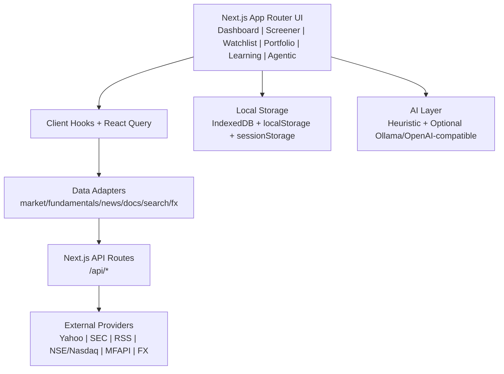

# Stock Metrics

“AI-Powered Personalized Stock Metrics & Investment Dashboard” is a full-stack, stock market analysis web application, which is AI driven and is designed to provide retail investors, finance students, and market learners with a unified workspace for multi-market research, intelligent screening, portfolio observation, price alerting, learning resource discovery, and AI-assisted investment guidance.

It ships with:
- `PRO` + `Beginner` modes
- Dark/Light theme toggle
- Universal search (US / India / Mutual Funds)
- `Q/A` tab for general-purpose chat
- Stock detail page (about, metrics, statements, charts, peer comparison, news, docs, notes)
- Rule-based AI layer
- AI screener (rule parser) + built-in strategies
- Watchlist / Portfolio / Notes stored (IndexedDB)
- Learning tab with local markdown knowledge base + optional AI providers

## Non-negotiable goals covered
- **Fast UI**: React Query caching, debounced search, dynamic chart import, downsampling, virtualization, skeletons.
- **Easy setup**: `npm install && npm run dev`
=======
**One-line summary:** Stock Metrics is a static-first, local-first stock analysis platform for India, US, and Mutual Funds that combines free market data, explainable rule-based intelligence, and optional AI providers.

## Table of Contents

1. [Project Overview](#project-overview)
2. [Features](#features)
3. [System Architecture](#system-architecture)
4. [Installation Guide](#installation-guide)
5. [Environment Variables](#environment-variables)
6. [API Integrations](#api-integrations)
7. [AI/ML and Recommendation Engine](#aiml-and-recommendation-engine)
8. [Performance Optimizations](#performance-optimizations)
9. [Security](#security)
10. [Deployment](#deployment)
11. [Contributors](#contributors)
12. [License](#license)

## Project Overview
>>>>>>> aedfb00 (Readme)

### What problem this project solves

Retail investors usually face one or more of these problems:

- Paid market APIs are expensive for side projects and students.
- Many tools hide recommendation logic behind black-box outputs.
- Portfolio tools, learning resources, and analysis are spread across multiple apps.
- New investors need beginner-friendly guidance, while experienced users need deeper diagnostics.

Stock Metrics solves this by providing a single web app with free-first data access, local-first persistence, and transparent recommendation logic.

### Target users

- Individual investors in India and US markets
- Students and beginner investors learning fundamentals
- Users who want local/private-first workflows (watchlist, notes, portfolio) without mandatory backend storage
- Developers who want an extensible stock analytics starter built on Next.js

### Why this project exists

The project was designed to prove that a useful stock analytics platform can run with:

- No mandatory paid APIs
- No mandatory cloud database for personal data
- Graceful degradation when live feeds are missing
- Explainable recommendation outputs rather than opaque prompts

### Key differentiators

- **Zero-key baseline mode:** App works without paid API keys.
- **Hybrid intelligence:** Deterministic heuristics + optional LLM integrations.
- **Explainable agentic analysis:** Risk profile, fit score components, confidence ranges, and data freshness are all exposed.
- **Cross-market scope:** India equities, US equities, and Indian mutual funds.
- **Local-first data ownership:** Portfolio transactions, watchlists, notes, and custom screens are stored in IndexedDB.

## Features

### Market data and research

- Universal search across US, India, and Mutual Funds
- Quote and history charts with multiple ranges (1M to Max)
- Key metrics and financial statements (P&L, quarterly, balance sheet, cash flow)
- Company documents integration (SEC filings, annual reports, presentations)
- News feed with relevance filtering and sentiment scoring
- USD/INR FX context for cross-market comparison

### Analysis and recommendations

- Rule-based AI insights (works in default no-key mode)
- Beginner assessment panel with metric-specific explanations
- AI Screener with natural-language query parsing and built-in strategies
- Agentic personalized engine with user profile capture, suitability scoring, recommendation pools (India, US, MF), and an action panel with allocation and holding-period guidance

### Portfolio, watchlist, and notes

- Multi-watchlist local persistence
- Portfolio transaction tracking with P&L and allocation views
- Stock-level personal notes
- Local snapshots and reusable analysis memory hooks

### Alerts and notifications

- Price alert condition engine (`above`/`below` threshold)
- Optional email alerts via Gmail SMTP
- Optional WhatsApp alerts via Twilio API

### Learning and Q/A

- Local markdown-based learning content hub
- Learning assistant with heuristic retrieval
- Q/A tab backed by local Ollama (optional)
- Optional OpenAI-compatible provider path for learning assistant answers

### UX and mode support

- PRO and Beginner mode support
- Dark/light theme support
- Skeleton loading patterns and responsive dashboard layout

## System Architecture

Stock Metrics uses a **client-heavy, static-first architecture** with lightweight Next.js route handlers as integration boundaries.



### Core layers

- **Presentation layer:** `src/app`, `src/components`
- **State and hooks:** React Query + Zustand (`src/lib/hooks`, `src/stores`)
- **Domain adapters:** `src/lib/data/adapters`
- **Provider integrations:** `src/lib/data/providers`
- **AI/Agentic logic:** `src/lib/ai`, `src/lib/agentic`
- **Persistence:** IndexedDB repositories (`src/lib/storage`, `src/lib/storage/repositories.ts`)

### Data flow (stock detail)

1. User opens `/dashboard/[market]/[symbol]`.
2. UI hook calls `getStockDetail(symbol)`.
3. Adapter fan-out fetches quote, history, fundamentals, news, docs in parallel.
4. Route handlers call provider modules and return normalized responses.
5. UI renders only available metrics; missing fields are hidden, not fabricated.

For a full architecture map, see `docs/architecture-diagram.md`.

## Installation Guide

### Prerequisites

- Node.js 18+ (Node 20 recommended)
- npm

### 1. Clone and install

```bash
git clone <your-repo-url>
cd StockMetrics
npm install
```


Open: [http://localhost:3000](http://localhost:3000)

## Build

```bash
npm run build
```

## Run tests

```bash
npm test
```

4. Environment variables are optional (only needed for optional AI/auth providers).

Notes:
- Cloudflare build environments are typically Node 20+, which is ideal for `@cloudflare/next-on-pages`.
- The app itself runs locally with no API keys and no backend setup.

## Alternative free deployment (Vercel)

- Import the repo into Vercel
- No env vars required for default mode
- Deploy with default `npm run build`

## Data Sources (free only) + fallback behavior

### Market prices/history
- **Yahoo Finance chart endpoint (no API key)** via local `/api/market/*` proxy
- If unavailable/rate-limited: **deterministic demo fallback history** (clearly labeled delayed/demo)

### Fundamentals
- **US**: SEC EDGAR Company Facts + filings (free)
- **India**: best-effort demo/curated fundamentals fallback (free public India fundamentals are often inconsistent without paid APIs)
- Missing metrics are **hidden** (not guessed)

### News
- **Google News RSS** (no key) via `/api/news`, filtered by ticker/company relevance
- Fallback demo news if feed fails

### FX (USD->INR)
- `open.er-api.com` (no key) via `/api/fx/usd-inr`
- Cached value in IndexedDB + stale fallback if request fails

## AI Layer (works offline/free by default)

### Default provider (no API key)
- Deterministic heuristics + templates
- Lexicon-based news sentiment
- Rule-based bull/bear periods, risk checks, fraud red flags
- Baseline trend forecasts
- Statement summaries (heuristic)
- Beginner “Should I consider buying?” panel (educational only)

### Optional providers
Configure via `.env` (not required):
- Local Ollama endpoint (`qwen3` is a good default for the general Q/A tab)
- OpenAI-compatible endpoint

These are behind a provider interface (`src/lib/ai/*`) so the app works without them.

## Auth (optional, default local-only)

### Default
- **Guest mode / local demo auth** (no backend required)
- Local IndexedDB fake session + local username/email/password for demo UX
- Includes demo “Google” login button behavior for local adapter

### Optional Firebase Auth
- Adapter interface included (`src/lib/auth/*`)
- Set env vars and replace placeholder adapter with Firebase SDK integration if desired

## Feature map

### Dashboard (PRO + Beginner)
- Universal search
- Dashboard market tabs: US / Indian / Mutual Funds
- Stock detail page with:
  - About + website link
  - Key metrics (only available ones)
  - Income statements (P&L, Quarterly, Balance Sheet, Cash Flow)
  - Consolidated/Standalone toggle (UI + heuristic summary)
  - Charts (1M/6M/3Y/5Y/Max)
  - Shareholding pattern
  - AI insights (heuristic)
  - Peer comparison + manual compare input
  - Export to Excel (.xlsx)
  - News, documents, notes
  - US values currency toggle (USD/INR)
  - Market open/closed + last update + next open (IST display)

### Screener
- AI screener natural language parser (rule-based)
- Built-in strategies: Piotroski (approx), Magic Formula, Coffee Can, Quality, Value, Momentum
- Custom screens stored locally
- Virtualized results table

### Watchlist
- Multiple watchlists
- Local persistence
- Quick sparkline + short-term move indicator

### Portfolio
- Buy/sell transaction tracking
- Holdings + P&L + allocation bars
- Local persistence

### Learning
- Local markdown docs knowledge base
- Q&A assistant with heuristic retrieval/answers
- Optional Ollama/OpenAI-compatible provider support

### Q/A
- General-purpose local chat tab backed by Ollama
- No API key required
- No in-app request cap when running locally
- Status panel shows whether Ollama is reachable and which local model is active

## Folder structure

```text
src/
  app/            # App Router pages + api routes
  components/     # UI and feature components
  lib/            # data adapters, providers, AI, storage, utils
  stores/         # Zustand stores (theme/mode/auth)
  types/          # domain types
  content/        # learning markdown docs
tests/            # minimal unit tests
```

## Important transparency notes

- This app does **not** claim real-time market data.
- Data quality varies by symbol and market because only free sources are used.
- Some advanced fundamentals for Indian stocks are best-effort/demo unless a reliable free provider is added.
- When a metric is missing, the UI intentionally hides it.

## Optional configuration

Copy env file if needed:
=======
### 2. (Optional) Configure environment
>>>>>>> aedfb00 (Readme)

```bash
cp .env.example .env.local
```

You can run the app without setting any env vars in baseline mode.

### 3. Run development server

```bash
npm run dev
```

Open [http://localhost:3000](http://localhost:3000)

### 4. Run tests

```bash
npm test
```

### 5. Build for production

```bash
npm run build
npm run start
```

## Environment Variables

### Required vs optional

- **Required for baseline app:** None
- **Optional by feature:** All variables in `.env.example` are feature-gated

### Environment variable matrix

| Variable | Required | Purpose | Where to get it |
| --- | --- | --- | --- |
| `OPENAI_COMPATIBLE_BASE_URL` | Optional | Base URL for OpenAI-compatible chat endpoint | Your compatible provider docs |
| `OPENAI_COMPATIBLE_API_KEY` | Optional | Auth key for compatible provider | Your compatible provider dashboard |
| `OPENAI_COMPATIBLE_MODEL` | Optional | Model name for compatible provider | Your compatible provider model list |
| `OLLAMA_BASE_URL` | Optional | Local Ollama host | Local Ollama install (`http://localhost:11434` default) |
| `OLLAMA_MODEL` | Optional | Ollama model name | `ollama list` output |
| `GMAIL_SMTP_USER` | Optional | Sender Gmail account for alert emails | Google account settings |
| `GMAIL_SMTP_APP_PASSWORD` | Optional | App password for Gmail SMTP | Google Account -> Security -> App passwords |
| `GMAIL_FROM_NAME` | Optional | Display name in outgoing alert email | Custom value |
| `TWILIO_ACCOUNT_SID` | Optional | Twilio API account SID | Twilio Console |
| `TWILIO_AUTH_TOKEN` | Optional | Twilio auth token | Twilio Console |
| `TWILIO_WHATSAPP_FROM` | Optional | Twilio WhatsApp sender (`whatsapp:+...`) | Twilio WhatsApp Sandbox/approved sender |
| `NEXT_PUBLIC_FIREBASE_API_KEY` | Optional* | Firebase web config | Firebase Console -> Project Settings |
| `NEXT_PUBLIC_FIREBASE_AUTH_DOMAIN` | Optional* | Firebase auth domain | Firebase Console |
| `NEXT_PUBLIC_FIREBASE_PROJECT_ID` | Optional* | Firebase project id | Firebase Console |
| `NEXT_PUBLIC_FIREBASE_APP_ID` | Optional* | Firebase app id | Firebase Console |
| `NEXT_PUBLIC_FIREBASE_STORAGE_BUCKET` | Optional | Firebase storage bucket | Firebase Console |
| `NEXT_PUBLIC_FIREBASE_MESSAGING_SENDER_ID` | Optional | Firebase messaging sender id | Firebase Console |
| `NEXT_PUBLIC_FIREBASE_MEASUREMENT_ID` | Optional | Firebase analytics measurement id | Firebase Console |
| `NEXT_PUBLIC_ENABLE_FIREBASE_AUTH` | Optional | Force Firebase auth on/off (`true`/`false`) | Set manually |
| `NEXT_PUBLIC_DEFAULT_AI_PROVIDER` | Optional | Default AI provider selector (`heuristic`, `ollama`, `openai-compatible`) | Set manually |

`*` Firebase Auth requires at least API key, auth domain, project id, and app id when enabled.

### Notes

- Keep secrets only in `.env.local` (already ignored by `.gitignore`).
- Restart dev server after changing env variables.
- If optional integrations are missing, the app degrades gracefully.

## API Integrations

### Internal API routes

| Route | Function |
| --- | --- |
| `/api/search/universal` | Universal symbol/entity search and symbol resolution |
| `/api/market/quote` | Latest quote (Yahoo or MFAPI) |
| `/api/market/history` | Historical candles/NAV series |
| `/api/fundamentals/us` | US fundamentals from SEC EDGAR |
| `/api/news` | Filtered Google News RSS feed |
| `/api/documents` | SEC filings (US) and public company documents (India) |
| `/api/fx/usd-inr` | USD to INR conversion snapshot |
| `/api/qa/status` | Ollama availability/status |
| `/api/qa/chat` | Q/A chat via Ollama |
| `/api/alerts/email` | Optional email notifications |
| `/api/alerts/whatsapp` | Optional WhatsApp notifications |

### External providers and usage

| Provider | Used for | Auth required |
| --- | --- | --- |
| Yahoo Finance chart endpoint | Stock quotes and price history | No |
| SEC EDGAR (companyfacts + submissions) | US fundamentals and filings | No |
| Nasdaq Trader symbol directories | US search index | No |
| NSE equity list | India search index | No |
| MFAPI / AMFI | Mutual fund index, NAV history, quote | No |
| Google News RSS | News feed | No |
| open.er-api.com | USD/INR FX rate | No |
| Twilio API | WhatsApp alerts (optional) | Yes (optional feature) |
| Gmail SMTP | Email alerts (optional) | Yes (optional feature) |
| Firebase Auth | Cloud auth (optional) | Yes (optional feature) |
| Ollama local API | Local Q/A and optional AI answers | Local runtime |

### Integration behavior

- Provider calls are wrapped with in-memory TTL cache on both client and server paths.
- Most routes include `Cache-Control` headers with `stale-while-revalidate` where appropriate.
- When provider requests fail, adapters fall back to demo/reference data where available.

## AI/ML and Recommendation Engine

Stock Metrics uses a **hybrid intelligence model**:

- **Default engine:** deterministic rule-based heuristics (no key required)
- **Optional providers:** Ollama and OpenAI-compatible endpoint for selected workflows

### Profile inputs (agentic mode)

The personalized engine captures rich household and investor context, including:

- Demographics: age, marital status, dependents
- Employment and income: job type, monthly income, tax rate
- Expenses and liabilities: fixed/discretionary spend, loans/EMI
- Protection and cashflow support: insurance cover/policies, debt/FD interest
- Assets and retirement corpus: equity/debt/gold/cash/alternatives + EPF/PPF/NPS
- Investment intent: goal, horizon, risk preference, liquidity need, target return
- Scope controls: market scope (India/US/both), specific ticker mode, compare-with-alternatives

### Risk profiling logic

The engine computes a `riskProfileScore` (0-100) from:

- age and life stage
- dependents
- debt burden and emergency coverage
- horizon and user-declared risk preference
- liquidity need
- income stability and insurance adequacy

Risk label thresholds:

- `>=72`: Aggressive
- `>=48`: Moderate
- `<48`: Conservative

Policy overrides can downgrade risk label (for example high debt burden, very low emergency fund, weak protection with dependents).

### Scoring logic

For each analyzed security, the engine computes:

- `stockQuality` from fundamentals + technicals + DCF + sentiment
- `riskCompatibility` between user risk target and stock risk level
- `portfolioFit` based on allocation gaps and concentration/diversification context
- `lifeStageFit` based on goal, horizon, dependents, liquidity and household constraints

Default weighted fit:

- Stock Quality: `40%`
- Risk Compatibility: `25%`
- Portfolio Fit: `20%`
- Life-stage Fit: `15%`

Final recommendation thresholds:

- `>=68`: `BUY`
- `52-67`: `HOLD`
- `<52`: `AVOID`

### Recommendation pipeline

1. Validate and normalize profile input
2. Build household cash-flow and allocation diagnostics
3. Load market universe (live index, demo fallback, or mixed)
4. Pre-screen and select candidates for deep analysis
5. Deep-analyze each candidate (fundamentals, technicals, risk, DCF, sentiment)
6. Apply personalized weighting and risk guardrails
7. Build recommendation pools (India stocks, US stocks, mutual funds)
8. Produce final action output (headline, allocation/month, holding period, cautions)

### Explainability outputs

Each recommendation includes:

- component scores and weighted contributions
- confidence score, fit interval (`fitLow`/`fitHigh`), uncertainty percentage
- provenance per metric channel (quote/history/fundamentals/news/dcf)
- freshness classification (`Live`, `Delayed`, `Demo fallback`)
- support points, caution points, and key reason
- tax impact note and holding period context

### Guardrails and risk controls

Engine-level guardrails can force `HOLD CASH` when:

- confidence is too low
- quote/history freshness is fallback-heavy
- household surplus is insufficient

This prevents overconfident calls on low-quality or stale data.

## Performance Optimizations

The app includes several practical optimization layers:

- **React Query defaults:** query stale/gc windows, retry caps, window-focus controls
- **Client-side TTL cache:** `fetchJsonWithTtl` memoizes adapter fetches
- **Server-side TTL cache:** `withServerCache` reduces provider call frequency
- **Debounced search inputs:** used in universal search, watchlist, alerts, portfolio, and agentic ticker lookup
- **Virtualized tables:** large screener-style lists rendered with `@tanstack/react-virtual`
- **Chart data thinning:** long series are sampled/thinned before rendering heavy chart views
- **Dynamic imports:** chart and devtools are lazily loaded to reduce initial bundle pressure
- **Graceful fallbacks:** avoids UI blocking when provider integrations fail

## Security

### Current security posture

- Secrets for optional integrations are read from server-side env vars.
- API routes validate required inputs and return explicit error responses.
- `.env` and `.env.local` are git-ignored.
- Firebase auth (when enabled) uses official SDK flows and provider/domain checks.

### Important caveat

- The local auth adapter is intentionally **demo-grade** and stores credentials in browser storage with lightweight hashing. It is not intended for hardened internet-facing production without additional security work.

### Production hardening recommendations

- Use Firebase Auth or another managed identity provider in production.
- Add rate limiting and abuse protection on alert/QA endpoints.
- Add stricter content validation and request throttling for message endpoints.
- Add security headers/CSP policy and audit dependency updates regularly.

## Deployment

Stock Metrics is built as a **static-first Next.js app** with optional route handlers.

### Option A: Cloudflare Pages (recommended in this project)

1. Push repository to GitHub.
2. Create Cloudflare Pages project.
3. Configure build as: build command `npm run build:cloudflare`, build output directory `.vercel/output/static`, and functions directory `.vercel/output/functions`.
4. Add env vars only for optional features you enable.

### Option B: Vercel

1. Import repository in Vercel.
2. Use default Next.js build (`npm run build`).
3. Add optional env vars as needed.

### Post-deploy checklist

- Verify `/api/search/universal`, `/api/market/quote`, and `/api/news` responses.
- If alerts are enabled, test both email and WhatsApp routes.
- If Firebase is enabled, test register/login/forgot-password flows.
- If Ollama is used in hosted environments, ensure network access to the configured Ollama endpoint.

## Contributors

Contributions are welcome.

- Open an issue describing the change.
- Create a feature branch.
- Add/update tests where relevant.
- Submit a pull request with a clear summary.

If you want a formal contributor roster, add a `CONTRIBUTORS.md` file and reference names/handles there.

## License

A license file is not currently included in this repository.

Until a license is added, default copyright protections apply. If you intend to open-source this project, add a `LICENSE` file (for example MIT, Apache-2.0, or GPL) and update this section.
