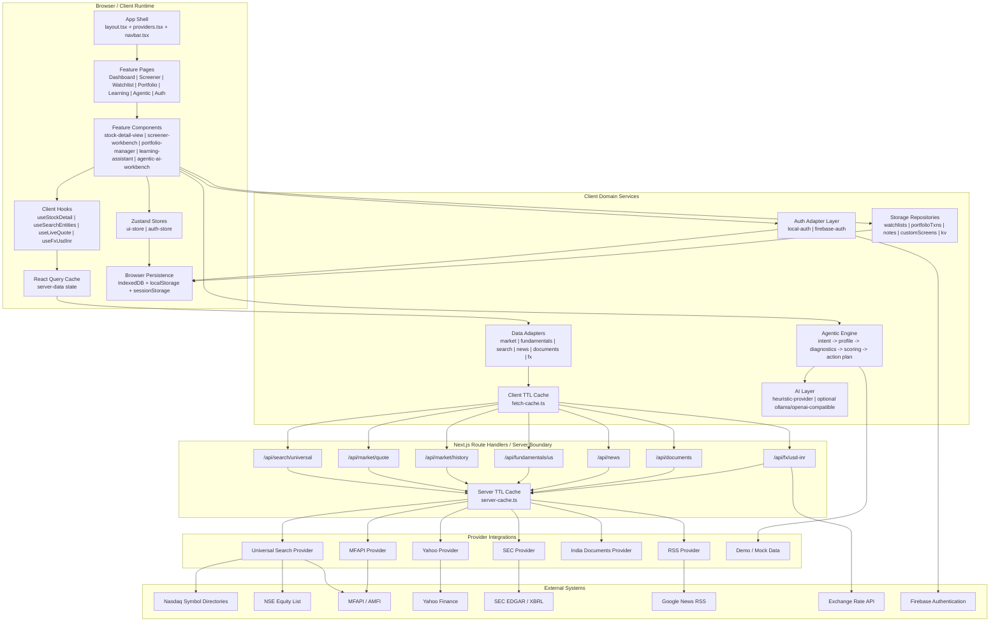
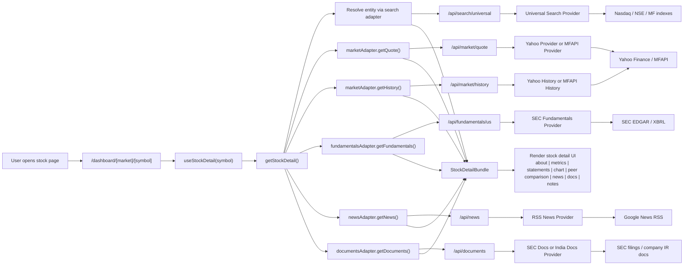
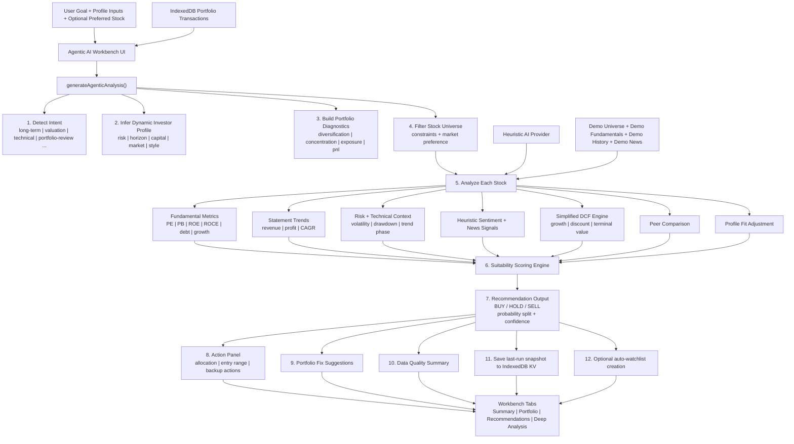
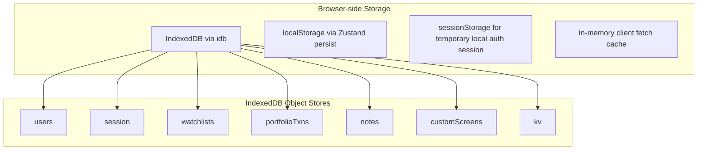

# Stock Metrics Architecture Diagram

This document represents the actual architecture implemented in the project.

## 1. Overall System Architecture

## 2. Stock Detail Data Flow

## 3. Agentic AI Architecture

## 4. Storage Architecture

## 5. Key Architectural Characteristics

- `Modular`: UI does not call provider APIs directly; adapters isolate data-source complexity.
- `Local-first`: user-owned data is persisted in the browser, not a remote database.
- `Static-first + route-based backend`: most backend logic is implemented through lightweight Next.js route handlers.
- `Explainable AI`: Agentic AI is workflow-based and scoring-based, not only prompt-based.
- `Extensible`: provider interfaces allow future replacement or expansion of data sources and auth backends.

